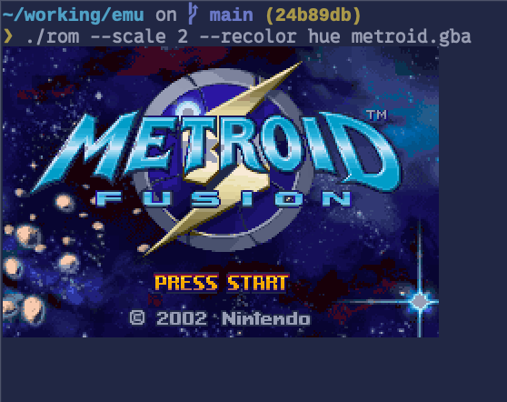

# rom

Play ROMs directly in your terminal.

`rom` is a small libretro frontend for macOS and Linux. It renders native
pixels with the kitty graphics protocol, supports real key-release events,
save states, audio, fast-forward, and live terminal-theme recoloring.



`rom` does not include games, BIOS files, or emulator cores. Only run software
you are legally entitled to use.

## Quick start

You need [Ghostty](https://ghostty.org/) or
[kitty](https://sw.kovidgoyal.net/kitty/) and a C compiler.

On macOS:

```sh
xcode-select --install
```

On Ubuntu or Debian:

```sh
sudo apt install build-essential libasound2-dev
```

Then:

```sh
git clone https://github.com/jhickner/rom
cd rom
make
make core-snes
./rom "path/to/game.sfc"
```

For Game Boy Advance, use `make core-gba` and pass a `.gba` file.

Run `rom` directly in Ghostty or kitty, not inside tmux. tmux interferes with
the graphics and keyboard protocols.

Optional installation:

```sh
make install PREFIX="$HOME/.local"
```

## Cores

`rom` uses libretro cores: `.dylib` on macOS and `.so` on Linux. These targets
build and install the tested cores:

```sh
make core-snes
make core-gba
```

If a core is missing, run the ROM anyway. `rom` prints the required filename
and either an exact build command or the upstream repository.

Cores are searched in:

1. `~/.config/rom/cores/`
2. `./cores/`
3. `<executable>/../cores/`

Use `--core <path>` to select one directly.

| ROM | Core |
|---|---|
| `.sfc` `.smc` `.fig` | `snes9x_libretro` |
| `.nes` | `fceumm_libretro` |
| `.gb` `.gbc` | `gambatte_libretro` |
| `.gba` | `mgba_libretro` |
| `.md` `.gen` `.smd` | `genesis_plus_gx_libretro` |
| `.pce` | `mednafen_pce_fast_libretro` |

## Usage

```sh
./rom [options] <rom>
```

| Option | Description |
|---|---|
| `--core <path>` | Use a specific core |
| `--fullscreen` | Fill the terminal window |
| `--scale <n>` | Integer zoom in inline mode, 1–8 |
| `--slot <n>` | Initial save-state slot, 0–9 |
| `--no-audio` | Disable audio |
| `--recolor <mode>` | `off`, `hue`, `nearest`, `duotone`, or `dither` |
| `--recolor-strength <0..1>` | Blend recoloring with the original |
| `--keys` | Print current key bindings |
| `--selftest <n>` | Run `n` frames without a terminal |
| `--shot <file>` | Save the final self-test frame as BMP |
| `--force` | Skip terminal graphics detection |

Inline mode is the default. It leaves scrollback intact and keeps the final
frame on screen when the game exits.

### Controls

| Key | Action |
|---|---|
| Arrows | D-pad |
| `z` / `x` | B / A |
| `a` / `s` | Y / X |
| `q` / `w` | L / R |
| Enter / Right Shift | Start / Select |
| Ctrl+C or Ctrl+Q | Quit |
| `p` | Pause |
| F2 / F3 | Save / load state |
| F6 / F7 | Previous / next slot |
| F5 | Reset |
| Tab | Fast-forward while held |
| F8 | Cycle recolor mode |
| `-` / `=` | Volume down / up |
| `m` | Mute |

## Terminal colors

`rom` reads the terminal's ANSI palette, foreground, and background at
startup. Colors are matched perceptually in Oklab through a prebuilt lookup
table, so the result is stable and fast.

| Mode | Result |
|---|---|
| `hue` | Keeps shading while adopting theme hues |
| `nearest` | Maps directly to the terminal palette |
| `duotone` | Uses the background-to-foreground ramp |
| `dither` | Mixes nearby palette colors to recover shades |

Start with `--recolor hue`. Press F8 to compare modes while playing.

## Config and saves

The config is created at `~/.config/rom/config`. Edit it to change keys,
volume, scale, recoloring, or focus behavior.

```ini
[options]
scale            = 2
recolor          = hue
recolor_strength = 1.00
pause_on_unfocus = true

[options.gb]
scale = 4
```

Sections may be suffixed with `snes`, `nes`, `gb`, `gba`, `genesis`, or `pce`
for system-specific overrides. Run `rom --keys <rom>` to see the effective
settings.

| Path | Contents |
|---|---|
| `~/.config/rom/config` | Settings and bindings |
| `~/.config/rom/saves/` | Battery saves |
| `~/.config/rom/states/` | Save states |
| `~/.config/rom/rom.log` | Frontend and core log |

Games pause when the terminal loses focus and resume when it returns. Saves
are written atomically and SRAM is autosaved every five seconds when changed.

## Limitations

- macOS (CoreAudio) or Linux (ALSA)
- Ghostty or kitty required
- Software-rendered cores only; no GL or Vulkan cores
- Player 1 keyboard input only
- Core options use their defaults

Licensed under the [MIT License](LICENSE).
